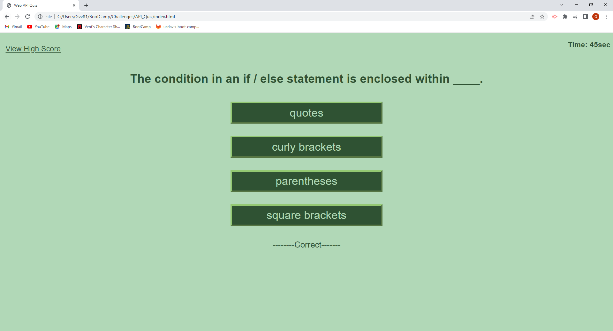

# API_Quiz

# Description

My motivation in this project was to test out these new javascript concepts I been learning such as qureySelector, eventListener, and Localstorage. I was unconfortable at first with the concept of adding elements and changing other ones already on the html file. The API Quiz is a good staring point for testing these new skills. I would be making elements or waiting for users to input text to continue on. This progression through the html file has taught me how to remove and edit html elements currently on the html file. Another important concept I had to review in this project was arrays and objects in Javascript. I was either trying to make an array of objects or making an object with objects in it. I was undecided on which was the proper approach to procced with my project. In the end I stuck with makeing an Object with Objects inside of it. Then while making a timer for the quiz I got stuck on syncing it with other events in my javascript. The timer function was simple at first, just a timer going down by one second, but I had to check for certain things at random points of time that either change the time or end the timer its self. Near the end of the project my javascript file was starting to become very big and I decided to split it up into two different files. This split in javascript led to me getting some experiance with JSON to store items in the local storage. I chose to use local storage to move data between the two files. I was not too focused on the css of the project. I was more focused on the functionality of the project. 

# Installation

    N/A

# Usage

The image above is the starting screen when you initally load the API Quiz project. Here in this page you have an introduction on what the quiz is. There are two different event listeners in this page. The first event listener is just where the text in the introduction is at. I have a button there on the page, but it is there to imply to the user that they have to click on the screen. Users can still click on the button too to start the quiz. The other event listener is at the very top where it says "view high score". If you click on that text you will be taken to the leader Board page displaying players highscore. 

The next image above is diplaying what happens after you start the quiz. The content in the html file has changed now. We have four buttons on the screen with a question on top. Something to mention here is that the "view high score" button is still up on top. The "view high score" button will not disapper and will be there though out the whole project. Another thing you may have noticed is the timer at the very top. The timer is ticking down every second. One cool feature about the timer is that it checks users response, so if you get answer wong on the quiz it will count down an additional 15 sec. If a user wants to know if they lost time or not there will be some text underneath the question options. The images below will display the two possible text messages that will appear.

The quiz will end when either the timer runs out or the player answers all the questions. Once the quiz is over it will instantly transition into the next screen seen above. This is the score collecting screen where we get users initials. Now here you will be given a text box entry. Users can put anything here if they do not want to put their initials. The only thing the project will not allow is an empty the text box entry.If the text box entry is left empty it will give out an alert stating "Please do not leave empty". You can put empty spaces in the text box and it will proceed like that if you wish. I could have made a more extensive error catching system here to look for just initials, but as it stands now you can enter anything here as long as its not empty.

After putting your initials you will transition to the final part of this html file the ending screen. This page just lets users to either go back to the home page to retake the test or give users the option to got to the leader board html page. The view high score page will be doing same task as the highScore Board button in the middleish of the html page. 

 

The leader board html page we go to is displaying all the players that have done the quiz locally on their device. This specific html file has its own javascript file that sorts the players. Now I will say the sorting is not perfect. Lets assume we a list of users and say the last person on the list got a score of 4 but ran out of time. They will be placed on the bottom no matter what. If there is any user who got a score of one and finished in time they will be placed above the user with a score of 4 but time of 0. Now this would be different if this user was the fist one on our list. The user will be placed as the last user that had a score of four or placed on top if 4 is the highest score and this can only occure if the user is placed first in the list. I could find a better way to sort the list it is not perfect.

Here is a link to my webpage: https://giovanne-villanueva.github.io/API_Quiz/

#License
Please refer to repo for license

#Credits
Thank you mdn web doc for help on:
Array pushing items: https://developer.mozilla.org/en-US/docs/Web/JavaScript/Reference/Global_Objects/Array/push
Array values: https://developer.mozilla.org/en-US/docs/Web/JavaScript/Reference/Global_Objects/Array/values
Redirecting html: https://www.w3schools.com/howto/howto_js_redirect_webpage.asp

